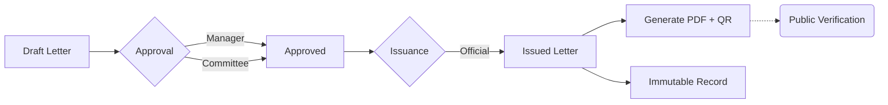

# MCC Letter Issuance System

> **A secure platform for drafting, approving, and verifying official letters.**

The **MCC Letter Issuance System** helps organizations generate tamper-proof official documents. It uses a strict "Draft -> Approve -> Issue" workflow, enforced by digital signatures and role-based security.

---

## ⚡ How It Works



---

## ✨ Key Features

-   **Role-Based Security**: Users Create, Managers Approve, and Admins Issue.
-   **Committee Mode**: Special letters require approval from specific committee members.
-   **Tamper-Proof**: Once issued, letters are "frozen" and cannot be changed.
-   **Public Verification**: Anyone can scan the QR code to verify validity.
-   **Audit Logs**: Every action (create, edit, approve) is recorded forever.

---

## 🚀 Quick Start

### 1. Prerequisites
-   Node.js (v18+)
-   Supabase Project

### 2. Install & Setup
```bash
# Clone and Install
git clone <repo-url>
npm install

# Setup Environment
cp apps/api/.env.example apps/api/.env
# Fill in your SUPABASE_URL and KEYS
```

#### Frontend Environment
Create `apps/web/.env` (or copy the example):
```bash
cp apps/web/.env.example apps/web/.env

VITE_API_URL=http://localhost:3000/api
VITE_SUPABASE_URL=<your-supabase-url>
VITE_SUPABASE_ANON_KEY=<your-supabase-anon-key>
# Optional: bypass auth for local demo/testing
VITE_DEMO_MODE=true
```

#### API Environment
Create `apps/api/.env` (or copy the example):
```bash
cp apps/api/.env.example apps/api/.env
```

### 3. Run the App
```bash
# Run everything (API + Frontend)
npm run dev -w @mcc/api & npm run dev -w web
```

-   **Web App**: `http://localhost:5173`
-   **API**: `http://localhost:3000`

---

## 🛠️ Tech Stack

| Component | Technology |
| :--- | :--- |
| **Frontend** | React, Tailwind, Radix UI (shadcn) |
| **Backend** | Node.js, Express, TypeScript |
| **Database** | Supabase (PostgreSQL + RLS) |
| **Security** | JWT Authentication, Row Level Security |

---
*Created for the MCC Project Class.*
