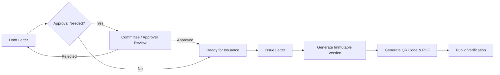

# MCC Official Letter Issuance and Verification System

## Overview

The **MCC Letter Issuance System** is a secure platform designed to manage the drafting, approval, issuance, and verification of official letters.

This system ensures:
*   **Drafting Workflow**: Structured letter creation with context, departments, and tags.
*   **Approval Hierarchy**: Role-based approvals (Creator, Approver, Issuer) and Committee-based approvals.
*   **Atomic Issuance**: Letters are issued with immutable version snapshots and cryptographic content hashes, utilizing optimistic concurrency control to prevent race conditions.
*   **Public Verification**: Issued letters can be verified by the public using a unique QR code or verification URL, ensuring authenticity and detecting revocations.
*   **Security**: Role-Based Access Control (RBAC) and strict Row Level Security (RLS) on the database.

## Key Features

### Role-Based Access Control (RBAC)
The system defines three primary roles to ensure secure operations:
*   **User**: Can create draft letters.
*   **Approver**: Can review and approve letters.
*   **Admin**: Has elevated permissions for system management and overriding approvals if necessary.

### Committee Workflows
Letters can be assigned to specific committees for specialized review.
*   If a letter is assigned to a committee (`committee_id`), it must be approved by a member of that committee.
*   These approvals are handled via a dedicated endpoint: `/api/letters/:id/committee-approve`.
*   Standard approvers who are not committee members cannot approve these letters.

### Atomic Issuance
To maintain data integrity during high-volume issuance:
*   The system uses a custom PostgreSQL RPC function `issue_letter`.
*   It implements **Optimistic Concurrency Control** by requiring an expected version number (`p_expected_version`) to prevent race conditions during version generation.

## Workflow



## Architecture

This project is a **Monorepo** managed with `npm workspaces`.

*   **`apps/api`**: The backend REST API.
    *   **Tech**: Node.js, Express, TypeScript.
    *   **Database**: Supabase (PostgreSQL).
    *   **Key Libs**: `jspdf` (PDF generation), `qrcode` (QR codes).
*   **`apps/web`**: The frontend web application.
    *   **Tech**: React, Vite, Tailwind CSS, TypeScript.
    *   **UI Libs**: Radix UI, Lucide React.
*   **`supabase/`**: Database migrations and configuration.

## Prerequisites

*   **Node.js**: v20 or higher is recommended.
*   **npm**: Included with Node.js.
*   **Supabase Project**: You need a Supabase project to run the backend.

## Installation

1.  Clone the repository.
2.  Install dependencies for all workspaces:
    ```bash
    npm install
    ```

## Environment Setup

The API requires environment variables to connect to Supabase. Create a `.env` file in `apps/api/` (or set them in your environment).

**Required Variables (`apps/api/.env`):**

```env
# Supabase Configuration
SUPABASE_URL=https://your-project.supabase.co
# Service Role Key is REQUIRED for Hard Mode (Production) and recommended for Dev to bypass RLS for Admin tasks
SUPABASE_SERVICE_ROLE_KEY=ey...
# Anon Key (Optional if Service Role Key is used for everything in Dev, but good practice to have)
SUPABASE_ANON_KEY=ey...

# App Configuration
PORT=3000
CLIENT_URL=http://localhost:5173
# Set to 'true' to enforce strict security (requires Service Role Key)
HARD_MODE=false
# Optional: Secret key for verifying access to verification endpoint if restricted
VERIFY_ACCESS_KEY=
```

**Frontend Variables (`apps/web/.env`):**

No specific `.env` is currently required for the frontend dev server, as it proxies API requests or connects directly (if configured). *Note: Ensure the `apps/web` configuration points to your API.*

## Running the Project

### Development

You can run the API and Web Client in separate terminals.

**1. Start the API:**

```bash
npm run dev -w @mcc/api
# OR
cd apps/api && npm run dev
```
*The API runs on port 3000 by default.*

**2. Start the Web Client:**

```bash
npm run dev -w web
# OR
cd apps/web && npm run dev
```
*The Web Client runs on http://localhost:5173 by default.*

### Production

To build the project for production:

```bash
# Build API
npm run build -w @mcc/api

# Build Web
npm run build -w web
```

## Testing

### Smoke Test (End-to-End)

A comprehensive smoke test script verifies the full lifecycle of a letter and security controls.

1.  Ensure the API is running (`npm run dev -w @mcc/api`).
2.  Run the smoke test:
    ```bash
    node scripts/smoke-test.js
    ```

**What it tests:**
*   **Lifecycle**: Create -> Approve -> Issue -> Verify.
*   **RBAC**: Verifies that specific roles (User, Approver, Issuer) are enforced.
*   **Committee Validation**: Ensures only committee members can approve committee-assigned letters.
*   **Idempotency**: Verifies that re-issuing the same letter returns the existing verification artifact without side effects.
*   **Security**: Checks that endpoints block unauthorized actions (e.g., standard approval on committee letters).

### Unit Tests

To run unit tests for the API:

```bash
npm test -w @mcc/api
```

## Database Migrations

Database schema changes are managed via Supabase migrations.

*   Migrations are located in `supabase/migrations/`.
*   The system uses an RPC function `issue_letter` for atomic issuance.
*   RLS policies are critical for security.

## License

ISC
