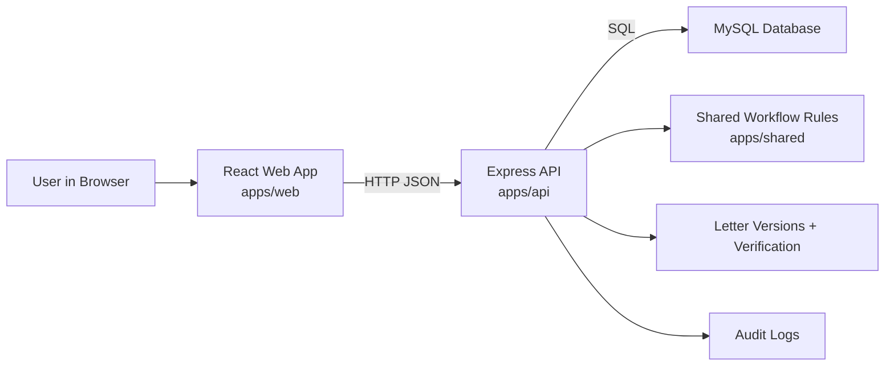
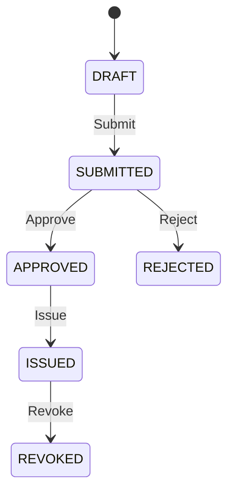
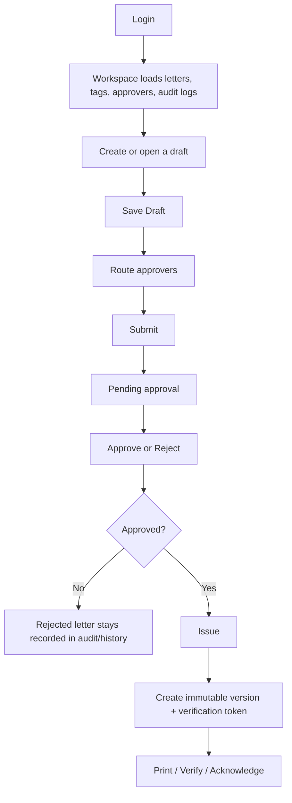
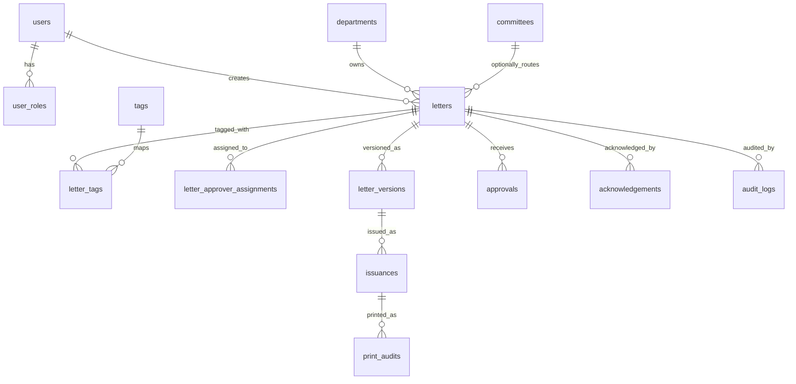
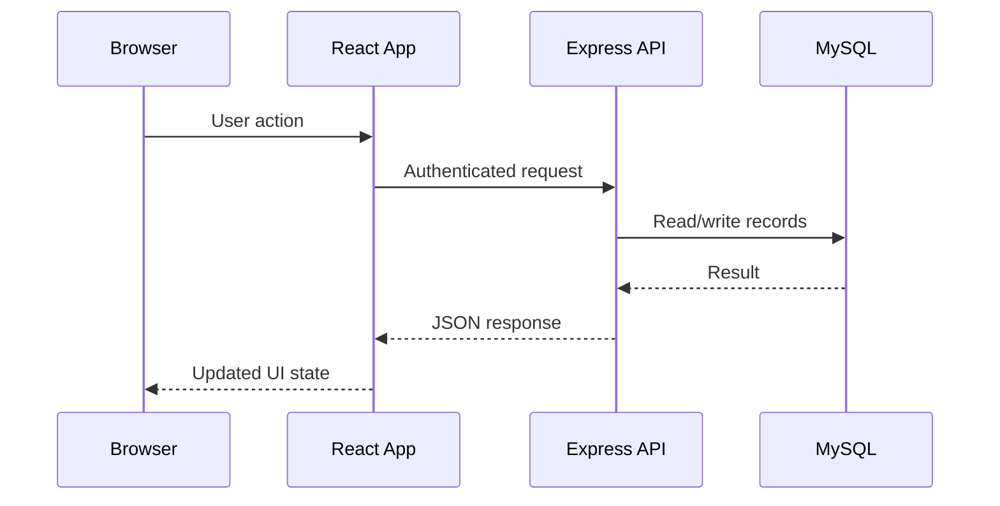
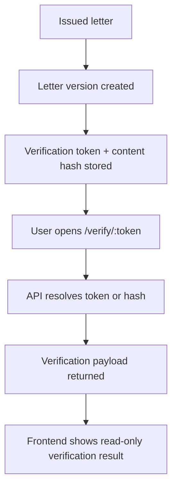

# MCC Letters

MCC Letters is a controlled letter drafting, approval, issuance, printing, and verification system.

It is built as a monorepo:
- `apps/api` is the Express + TypeScript API
- `apps/web` is the React + Vite frontend
- `apps/shared` contains shared enums and workflow constants
- `mysql/schema.sql` contains the main MySQL schema
- `mysql/MCC_LETTER_MODULE_SCHEMA.sql` is the client/server handoff schema file

The active product scope in this repo is the `COMPANY` letter workflow.

## What This Project Does

This system manages a letter from draft to final issued output.

Core lifecycle:
- Draft a letter
- Route it to approvers
- Submit it for approval
- Approve or reject it
- Issue it
- Print it
- Verify it later using a verification token or content hash

It also keeps an audit trail, supports attachments, stores immutable letter versions, and records print/issuance activity.

## High-Level Architecture


```mermaid
flowchart LR
    U["User in Browser"] --> W["React Web App<br/>apps/web"]
    W -->|HTTP JSON| A["Express API<br/>apps/api"]
    A -->|SQL| DB["MySQL Database"]
    A --> S["Shared Workflow Rules<br/>apps/shared"]
    A --> V["Letter Versions + Verification"]
    A --> AU["Audit Logs"]
```

## Letter Lifecycle


```mermaid
stateDiagram-v2
    [*] --> DRAFT
    DRAFT --> SUBMITTED: Submit
    SUBMITTED --> APPROVED: Approve
    SUBMITTED --> REJECTED: Reject
    APPROVED --> ISSUED: Issue
    ISSUED --> REVOKED: Revoke
```

Rules enforced by the API:
- Only drafts can be edited and submitted
- Only submitted letters can be approved or rejected
- Only approved letters can be issued
- Print is meant for issued letters
- Verification is read-only and does not change letter state

## End-to-End Flow


```mermaid
flowchart TD
    A["Login"] --> B["Workspace loads letters, tags, approvers, audit logs"]
    B --> C["Create or open a draft"]
    C --> D["Save Draft"]
    D --> E["Route approvers"]
    E --> F["Submit"]
    F --> G["Pending approval"]
    G --> H["Approve or Reject"]
    H --> I{"Approved?"}
    I -- No --> J["Rejected letter stays recorded in audit/history"]
    I -- Yes --> K["Issue"]
    K --> L["Create immutable version + verification token"]
    L --> M["Print / Verify / Acknowledge"]
```

## Monorepo Layout

```text
mcc_class/
|-- apps/
|   |-- api/       Express API, auth, routes, DB init
|   |-- shared/    Shared types/constants such as statuses
|   |-- web/       React frontend, Playwright tests
|-- mysql/
|   |-- schema.sql Database schema
|-- scripts/
|   |-- smoke-test.js
|   |-- cleanup_demo_data.js
|-- README.md
```

## Main Components

### Frontend

Important files:
- `apps/web/src/App.tsx`
- `apps/web/src/components/LetterWorkspace.tsx`
- `apps/web/src/components/Dashboard.tsx`
- `apps/web/src/components/AppShell.tsx`
- `apps/web/src/lib/auth.ts`

Frontend responsibilities:
- login/session handling
- loading workspace data
- creating and updating drafts
- routing/submitting/approving/issuing via API calls
- rendering verification view
- showing audit and lifecycle state

### API

Important files:
- `apps/api/src/app.ts`
- `apps/api/src/index.ts`
- `apps/api/src/auth-routes.ts`
- `apps/api/src/auth-middleware.ts`
- `apps/api/src/routes/letters.ts`
- `apps/api/src/routes/approvals.ts`
- `apps/api/src/routes/public.ts`

API responsibilities:
- JWT auth
- role checks
- lifecycle validation
- MySQL reads/writes
- letter versioning
- verification payload generation
- audit logging

## Database Model

This is the practical core of the schema.


```mermaid
erDiagram
    users ||--o{ user_roles : has
    users ||--o{ letters : creates
    departments ||--o{ letters : owns
    committees ||--o{ letters : optionally_routes
    letters ||--o{ letter_tags : tagged_with
    tags ||--o{ letter_tags : maps
    letters ||--o{ letter_approver_assignments : assigned_to
    letters ||--o{ letter_versions : versioned_as
    letters ||--o{ approvals : receives
    letter_versions ||--o{ issuances : issued_as
    issuances ||--o{ print_audits : printed_as
    letters ||--o{ acknowledgements : acknowledged_by
    letters ||--o{ audit_logs : audited_by
```

Core tables you will interact with most:
- `users`
- `user_roles`
- `departments`
- `tags`
- `letters`
- `letter_tags`
- `letter_approver_assignments`
- `letter_versions`
- `approvals`
- `issuances`
- `print_audits`
- `audit_logs`

## Roles and Permissions

Current role model:
- `ADMIN`
- `APPROVER`
- `ISSUER`

Typical expectations:
- `ADMIN` can operate broadly across the workflow
- `APPROVER` can approve assigned submitted letters
- `ISSUER` can issue approved letters

For a client/server deployment, keep demo mode disabled and create real users/roles explicitly.

## Demo And Reference Links

Current reference demo:
- Web: `https://mcc-class-demo-web.vercel.app`
- API: `https://mcc-class-demo-api.vercel.app/api`

This Vercel deployment is a demo/reference environment. It is useful for trying the workflow and understanding the product, but final client use should be deployed on an MCC-approved server/environment with real database credentials and real user access.

Repository branch for the current handoff:
- `codex/material-theme-db-fixes`

## Local Setup

### Prerequisites

- Node.js 18+
- npm
- MySQL 8+ or XAMPP MySQL

### Install

```bash
npm install
```

### API environment

Create `apps/api/.env`:

```env
MYSQL_HOST=localhost
MYSQL_PORT=3306
MYSQL_USER=root
MYSQL_PASSWORD=
MYSQL_DATABASE=mcc_letters
JWT_SECRET=dev-secret-change-in-production
JWT_EXPIRES_IN=7d
PORT=3000
CLIENT_URL=http://localhost:5173
ALLOW_REGISTRATION=false
DEMO_MODE=false
```

If you are using XAMPP, this usually means:
- host: `localhost`
- port: `3306`
- user: `root`
- password: blank by default

### Web environment

Create `apps/web/.env`:

```env
VITE_API_URL=http://localhost:3000/api
VITE_DEMO_AUTO_LOGIN=false
```

## Database Setup

Initialize the database through the repo script:

```bash
npm run db:init
```

Or apply the schema directly:

```bash
mysql -u root -p mcc_letters < mysql/schema.sql
```

For client/server handoff, use:

```bash
mysql -u <user> -p < mysql/MCC_LETTER_MODULE_SCHEMA.sql
```

Smoke-check the DB:

```bash
npm run db:smoke
```

## Run the App

Run API and web together:

```bash
npm run dev
```

Run services individually:

```bash
npm run dev -w @mcc/api
npm run dev -w web
```

Local URLs:
- Web: `http://localhost:5173`
- API: `http://localhost:3000`

## Demo Login

Default local demo account, if seeded for a private demo environment:
- Email: `admin@mcc.local`
- Password: `admin123`

## Commands You Will Use Most

### Root

```bash
npm run dev
npm run build
npm run lint
npm run test
npm run test:web
npm run db:init
npm run db:smoke
npm run cleanup
```

### API

```bash
npm run dev -w @mcc/api
npm run build -w @mcc/api
npm run typecheck -w @mcc/api
npm run test -w @mcc/api
```

### Web

```bash
npm run dev -w web
npm run build -w web
npm run lint -w web
npm run test:e2e -w web
```

## Quality Gates

Before pushing product changes, run:

```bash
npm run typecheck -w @mcc/api
npm run test -w @mcc/api
npm run lint -w web
npm run build -w web
npm run test:web
```

## Main API Surface

### Public endpoints

- `GET /api/departments`
- `GET /api/tags`
- `GET /api/verify/:token`

### Auth endpoints

- `POST /api/auth/register`
- `POST /api/auth/login`
- `GET /api/auth/me`
- `POST /api/register`
- `POST /api/login`
- `GET /api/me`

### Letter endpoints

- `GET /api/letters`
- `GET /api/letters/:id`
- `POST /api/letters`
- `POST /api/letters/:id/routing`
- `POST /api/letters/:id/submit`
- `POST /api/letters/:id/approve`
- `POST /api/letters/:id/reject`
- `POST /api/letters/:id/issue`
- `POST /api/letters/:id/print`
- `POST /api/letters/:id/deadline`

### Supporting endpoints

- `GET /api/approvers`
- `GET /api/approvals/pending`
- attachments, audit, analytics, acknowledgements, tags, reprints, email links, and committee routes under `/api`

## Request Flow


```mermaid
sequenceDiagram
    participant Browser
    participant Web as React App
    participant API as Express API
    participant DB as MySQL

    Browser->>Web: User action
    Web->>API: Authenticated request
    API->>DB: Read/write records
    DB-->>API: Result
    API-->>Web: JSON response
    Web-->>Browser: Updated UI state
```

## Verification Flow


```mermaid
flowchart TD
    A["Issued letter"] --> B["Letter version created"]
    B --> C["Verification token + content hash stored"]
    C --> D["User opens /verify/:token"]
    D --> E["API resolves token or hash"]
    E --> F["Verification payload returned"]
    F --> G["Frontend shows read-only verification result"]
```

## What Happens on Issue

When a letter is issued, the API does more than just update a status:
- validates that the letter is approved
- locks the record in a transaction
- creates the next immutable `letter_versions` row
- generates verification data
- creates an `issuances` row
- records audit activity

That is the core control point that makes issued output traceable.

## Pending Tasks Semantics

In the current product behavior:
- drafts are still pending work
- submitted letters are pending approval
- approved and rejected letters should not stay in the pending-task area

This is separate from the full stage board, which shows all letters by status.

## Attachments, Print, and Audit

### Attachments
- linked to a letter
- shown in the workspace
- intended to support letter-related evidence/files

### Print
- should only be meaningful after issuance
- print activity is auditable

### Audit
- important workflow events are recorded in `audit_logs`
- this supports investigation, traceability, and operational review

## Testing Strategy

There are two main testing layers.

### API tests

Located in `apps/api/src/*.test.ts`

These cover:
- auth utilities
- lifecycle edge cases
- route behavior
- draft save flows
- versioning
- verification behavior

### Web tests

Located in `apps/web/tests`

These cover:
- sign-in shell rendering
- auth page behavior
- draft save smoke flow
- new-letter workspace reset behavior
- verification route rendering

## Common Local Problems

### 1. `500` from `/api/letters`

Usually one of:
- MySQL is not running
- API env points at the wrong database/password
- schema not initialized

Check:
- `apps/api/.env`
- `npm run db:init`
- XAMPP MySQL status

### 2. You can log in but workflow actions behave like the wrong user

Check:
- `DEMO_MODE` setting
- current API process has been restarted after auth changes
- sign out and sign back in after backend auth fixes

### 3. Frontend starts but API calls fail

Check:
- API is running on `http://localhost:3000`
- `VITE_API_URL` is correct
- browser is not using stale local session state

### 4. Build passes but UI looks broken

Check:
- web CSS/theme changes
- action-button classes in `apps/web/src/index.css`
- whether the running dev server picked up the latest frontend build

## Current Product Boundaries

What this repo is clearly set up to do well right now:
- tracked COMPANY-context letters
- approval routing
- issuance and verification
- auditable workflow operations

What is present but not the primary focus:
- committee flow support
- broader BCBA-related paths
- future integrations such as richer email-classifier workflows

## Recommended Reading Order for New Developers

If you are new to this codebase, read in this order:

1. `README.md`
2. `apps/web/src/App.tsx`
3. `apps/web/src/components/LetterWorkspace.tsx`
4. `apps/api/src/app.ts`
5. `apps/api/src/routes/letters.ts`
6. `mysql/schema.sql`

That path gives you the fastest understanding of how UI actions become persisted lifecycle transitions.

## Production Readiness Checklist

Before deploying or handing this to another team:
- environment variables set correctly
- database initialized and reachable
- API typecheck green
- API tests green
- web lint green
- web build green
- web e2e tests green
- demo-mode behavior understood and acceptable for the environment
- verification route behavior validated

## License / Internal Use

No explicit license is declared in this repo. Treat it as internal/project-controlled code unless the repository owner defines otherwise.
